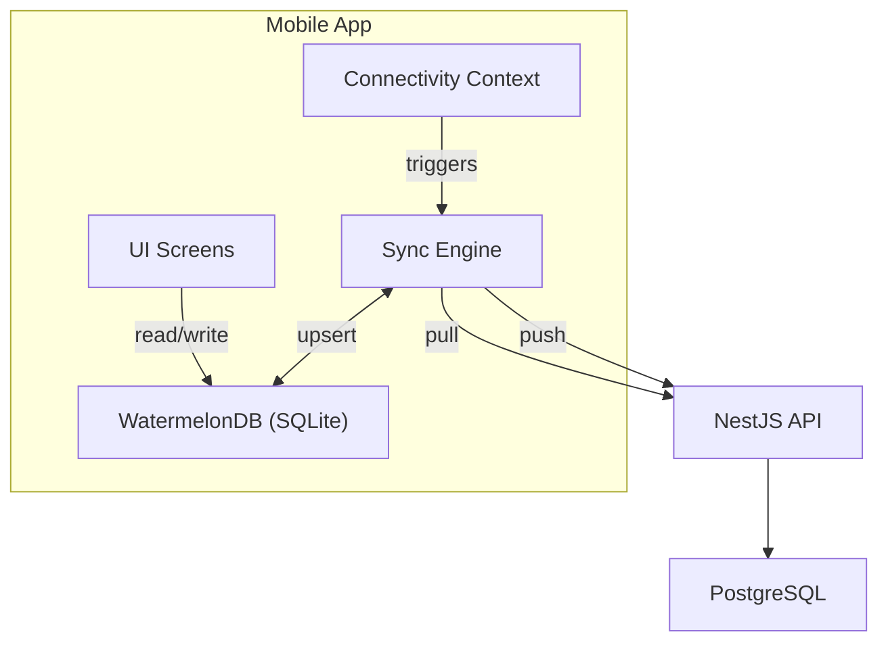

# Offline-First Architecture — Walkthrough

## Summary

Implemented a complete offline-first architecture for the AssetsAlly Auditor mobile app using **WatermelonDB** as the local database. The app now supports the full audit lifecycle offline: data seeding on login, local finding recording, and automatic sync when connectivity is restored.

---

## Architecture

## Files Created/Modified

### New Files (14)

| File                                                                                                     | Purpose                                                           |
| -------------------------------------------------------------------------------------------------------- | ----------------------------------------------------------------- |
| [schema.ts](file:///d:/PROJECTS/assetsally/apps/mobile/db/schema.ts)                                     | WatermelonDB schema (5 tables, 50+ columns)                       |
| [Location.ts](file:///d:/PROJECTS/assetsally/apps/mobile/db/models/Location.ts)                          | Location model                                                    |
| [InventoryItem.ts](file:///d:/PROJECTS/assetsally/apps/mobile/db/models/InventoryItem.ts)                | Inventory item model with JSON custom fields                      |
| [AuditReport.ts](file:///d:/PROJECTS/assetsally/apps/mobile/db/models/AuditReport.ts)                    | Audit report model with `needs_sync` flag                         |
| [AuditFinding.ts](file:///d:/PROJECTS/assetsally/apps/mobile/db/models/AuditFinding.ts)                  | Audit finding model with `needs_sync` flag                        |
| [SyncMeta.ts](file:///d:/PROJECTS/assetsally/apps/mobile/db/models/SyncMeta.ts)                          | Key-value metadata for sync timestamps                            |
| [models/index.ts](file:///d:/PROJECTS/assetsally/apps/mobile/db/models/index.ts)                         | Barrel export                                                     |
| [db/index.ts](file:///d:/PROJECTS/assetsally/apps/mobile/db/index.ts)                                    | Database singleton + collection accessors (Proxy-based lazy init) |
| [connectivity-context.tsx](file:///d:/PROJECTS/assetsally/apps/mobile/contexts/connectivity-context.tsx) | NetInfo-based connectivity provider                               |
| [sync-engine.ts](file:///d:/PROJECTS/assetsally/apps/mobile/services/sync-engine.ts)                     | Pull/push sync with conflict resolution                           |
| [useSync.ts](file:///d:/PROJECTS/assetsally/apps/mobile/hooks/useSync.ts)                                | Sync lifecycle hook (auto-pull, 30s push interval)                |
| [SyncStatusBar.tsx](file:///d:/PROJECTS/assetsally/apps/mobile/components/SyncStatusBar.tsx)             | Visual status bar (green/yellow/red)                              |
| [inventory.tsx](file:///d:/PROJECTS/assetsally/apps/mobile/app/audit/inventory.tsx)                      | New inventory view screen                                         |

### Modified Files (6)

| File                                                                                      | Changes                                                        |
| ----------------------------------------------------------------------------------------- | -------------------------------------------------------------- |
| [\_layout.tsx](file:///d:/PROJECTS/assetsally/apps/mobile/app/_layout.tsx)                | Added `ConnectivityProvider`, `SyncStatusBar`, inventory route |
| [auth-context.tsx](file:///d:/PROJECTS/assetsally/apps/mobile/contexts/auth-context.tsx)  | Clears WatermelonDB on logout                                  |
| [(tabs)/audits.tsx](<file:///d:/PROJECTS/assetsally/apps/mobile/app/(tabs)/audits.tsx>)   | Reads from WatermelonDB, shows sync indicators                 |
| [audit/[id].tsx](file:///d:/PROJECTS/assetsally/apps/mobile/app/audit/[id].tsx)           | Inline finding controls, offline badge, summary cards          |
| [(tabs)/index.tsx](<file:///d:/PROJECTS/assetsally/apps/mobile/app/(tabs)/index.tsx>)     | Sync status card, manual sync button                           |
| [(tabs)/profile.tsx](<file:///d:/PROJECTS/assetsally/apps/mobile/app/(tabs)/profile.tsx>) | Sync info section, force sync                                  |
| [tsconfig.json](file:///d:/PROJECTS/assetsally/apps/mobile/tsconfig.json)                 | Added `experimentalDecorators`                                 |

---

## Key Design Decisions

1. **Server UUIDs as local IDs** — Pulled records use their server UUID as the WatermelonDB `_raw.id`, avoiding ID mapping tables
2. **`needs_sync` flag** — Simple dirty-tracking: locally-created/modified records are flagged; sync clears the flag
3. **Conflict resolution** — Server wins for pulled data, but local changes (`needs_sync = true`) are never overwritten by pulls
4. **Per-finding push** — Uses existing `POST /audits/:id/findings` endpoint (upsert) rather than a new batch endpoint
5. **30-second push interval** — Auto-push runs every 30s when online and there are dirty records
6. **Lazy Database Init** — WatermelonDB initialization is deferred using ES Proxies to ensure the bundle loads in **Expo Go** for UI development.

## Verification

| Check                                   | Result                                                       |
| --------------------------------------- | ------------------------------------------------------------ |
| TypeScript compilation (`tsc --noEmit`) | ✅ Pass (0 errors)                                           |
| All dependencies installed              | ✅ `@react-native-community/netinfo` + existing WatermelonDB |
| Expo CLI Stability                      | ✅ Patched fetch bugs in `@expo/cli` for Node 20             |

> [!NOTE]
> **Manual testing required:** WatermelonDB uses JSI (native modules) and won't run in Expo Go for database operations. Use `npx expo run:android` or an EAS dev build to test the full offline workflow. The app will bundle and run in Expo Go for UI work thanks to lazy initialization.
